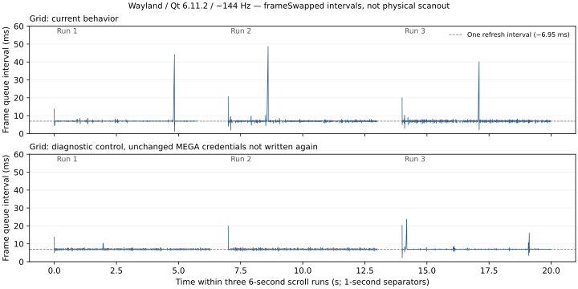

# Scroll cadence and visual-change research

Date: 2026-09-30. This is a separate investigation after the user confirmed
matching wheel behavior in Grid, Brief and Detailed. The initial investigation
made no production behavior change. Temporary instrumentation and experimental
controls were removed, preserving the previously accepted wheel changes.
The subsequently authorized MEGA fix and its verification are recorded below.

## Findings

1. **A measured source of periodic stalls is repeated MEGA credential writes in
   the GUI thread.** It affects scrolling of local folders too, when the MEGA
   account is authenticated. The frame queue normally advances at approximately
   6.95 ms, but paired authorization callbacks produce approximately 40–55 ms
   gaps. A diagnostic control that skips persistence of unchanged credentials
   removes that recurring class of gap.
2. **Grid and Brief remove already displayed thumbnails while scrolling.** This
   is a confirmed visual-content change, separate from missed frame deadlines.
   They switch to icons, then restore thumbnails after scrolling stops.
3. **Detailed media columns continue requesting metadata during scrolling.**
   This is confirmed background/GUI-completion work; these experiments do not
   establish it as the cause of the periodic stalls.
4. Physical scanout tearing was not measured or demonstrated. The current
   compositor reports tearing disabled; the app reports swap interval 1.

## Method and scope

Environment: Qt 6.11.2; native Wayland; KWin 6.7.5; OpenGL scene-graph API;
AMD RX 6600 XT; one 1920×1080 output at approximately 144 Hz, scale 1, VRR disabled.
KWin reports active blur and plasmaglow effects. No compositor settings/effects
were changed. These facts describe this session, not all machines.

The existing GUI navigation benchmark supplied isolated local fixtures and real
application panels/delegates. For this study, its 300 one-pixel PNG placeholders
were overwritten outside measured intervals with deterministic 1024×768 striped
images. The original one-pixel fixture cannot validate normal thumbnail display.
A control dataset contained 250 ordinary documents without image thumbnails.

Each case ran three approximately six-second streams of real Qt wheel events,
one detent every 80 ms, reversing near the bottom bound. Initial load, idle,
scrolling and post-stop phases were separated. Navigation, selected paths and
current index remained stable in all measured cases. This is synthetic Qt input,
not a recording of the physical mouse. OS cache was not forcibly dropped.

Recorded observations:

- Render-thread timestamps for frameSwapped, synchronization, and rendering,
  using direct connections and a shared, mutex-protected collector. Render
  callbacks never dereferenced GUI objects or expired stack references.
- GUI heartbeat intervals from a precise two-millisecond timer. These measure
  scheduling/blocking gaps, not an exact breakdown of CPU time.
- Directory dataChanged events and metadata completion signals.
- Sparse icon-cell snapshots before scrolling, after 100 ms of scrolling, and
  100/400/1000 ms after the last input. Tree walks were not run every frame.
- In later runs, exact QApplication::notify handler durations on the GUI thread
  and narrowly scoped timings around storage/provider/auth functions.

Qt documents frameSwapped as a frame being queued for presentation, and
beforeRendering/afterRendering bracket CPU-side recording work rather than GPU
completion. Thus these numbers do not measure physical scanout, input-to-photon
latency or full GPU execution. [Qt QQuickWindow documentation](https://doc.qt.io/qt-6/qquickwindow.html#frameSwapped).

## Periodic MEGA stall: source and measurements

The inspected path is:

1. `PlacesModel` refreshes account information every 5 seconds.
2. `megaAccountLabel()` invokes the MEGA `authStatus` action.
3. `triggerMegaAction()` requests account details for an authenticated account.
4. A successful TYPE_ACCOUNT_DETAILS completion emits
   `accountAuthorizationChanged`, even though the credentials need not change.
5. `MegaFileProviderPlugin` handles that signal on its GUI-thread QObject and calls
   `MegaAuth::rememberAuthorization()`.
6. That method writes the session and email unconditionally. On this Linux build,
   `writeCredentialText()` uses `secret_password_store_sync` twice.

There is an additional listener-registration clue: accountApiSession registers
MegaClient through `addListener(this)`, while requestAccountDetails supplies the
same object to `getAccountDetails(this)`. This is consistent with the observed
paired callbacks, but listener registration was not isolated in a separate
control here. Avoid claiming that removing one listener alone resolves the
credential persistence problem.

Relevant source: `src/models/PlacesModel.cpp` (constructor timer and
megaAccountLabel), `src/plugins/mega/MegaProviderActions.cpp` (authStatus),
`src/plugins/mega/MegaClient.cpp` (TYPE_ACCOUNT_DETAILS),
`src/plugins/mega/MegaFileProviderPlugin.cpp` (authorization connection),
`src/plugins/mega/MegaAuth.cpp` (rememberAuthorization/writeCredentialText).

The event observer identified consecutive QEvent::MetaCall handlers targeting
MegaFileProviderPlugin. In one matched event-observer run, a 47.7 ms GUI gap
contained two such handlers of 22.9 and 22.8 ms. Their intervals also aligned with
the approximately 47.7 ms frame queue gap. Scoped follow-up measurements confirmed
that these handlers spent their time persisting credentials: 17
rememberAuthorization calls in the baseline process, each 20.19–27.60 ms, with
`gui=1`. No credential values were logged.

For the causal control, only the diagnostic process skipped the callback's
persistence when BOTH cached session and email equalled the supplied, trimmed
values. New/changed credentials and volume polling were not skipped by this
control. This guard was subsequently removed. It is an experiment, not a shipped
fix or a complete account-lifecycle design.

### Matched Grid baseline/control

| Metric, three scroll runs | Baseline | Unchanged-credential control |
| --- | ---: | ---: |
| frame queue p95, all three runs | 7.52 ms | 7.36 ms |
| maximum interval, run 1 | 44.22 ms | 13.72 ms |
| maximum interval, run 2 | 48.65 ms | 19.97 ms |
| maximum interval, run 3 | 40.16 ms | 23.82 ms |
| intervals above 33 ms | 3 | 0 |
| directory dataChanged events | 0 | 0 |

The p95 values barely change because the long gaps are infrequent. Looking only
at an average or p95 would conceal the recurring stall.

The same diagnostic control was run in all three views with normal thumbnails:

| View | Run maxima, ms | Intervals above 33 ms |
| --- | --- | ---: |
| Detailed | 13.22 / 14.65 / 11.59 | 0 |
| Grid | 13.72 / 19.97 / 23.82 | 0 |
| Brief | 15.02 / 15.97 / 13.48 | 0 |

All four final baseline/control processes exited normally (status 0). Callback
times with unchanged-credential suppression were around 0.001–0.004 ms; no
rememberAuthorization calls occurred in those control processes. Residual
10–24 ms gaps remain, so this does not establish perfect frame pacing or explain
all possible stutters. The result supports addressing this specific repeated
credential-write path first.

### Rejected/limited hypotheses

Storage polling was investigated, not assumed responsible. Volume enumeration
was approximately 2–3 ms in measured steady-state callbacks; LinuxDeviceMonitor
returned its cached snapshot. Its synchronous GetManagedObjects path exists,
but was not being traversed each poll. Disabling only periodic VolumeMonitor
polling did NOT remove the long gaps (58.35 / 45.82 / 48.29 ms in three Grid runs).
Places refreshDriveInfo and system statistics also did not account for the
identified long handler intervals.

The document dataset reproduced long gaps in every view without image loading.
All scrolling phases had zero directory dataChanged events and stable selection.
This argues against directory refresh or thumbnail decode as the explanation for
the measured recurring 40–55 ms stalls in these settled local fixtures.

## Thumbnail removal and restoration

Both Grid and Brief incorporate thumbnailLoadingPaused in thumbnail eligibility.
Their queueThumbnailLoad functions clear thumbnailLoadEnabled when eligibility
becomes false. FileIconCell receives an empty thumbnailSource, clears its
thumbnailDisplayed flag and gives its Image an empty source. Already loaded
thumbnails therefore disappear along with suppression of new requests.

In the first normal-image run:

| View | Visible ready before | During scrolling | 400 ms after final input | 1000 ms after final input |
| --- | ---: | ---: | ---: | ---: |
| Grid | 36 | 0 | 9 | 45 |
| Brief | 44 | 0 | 0 | 44 |

Viewport contents moved, so before/after visible counts need not match. The key
observation is the source/showThumbnail/ready values becoming zero during motion,
then being rebuilt. Grid's buffer also means many offscreen cells are affected:
184 nonempty thumbnail sources before this run, zero during motion, then 300
afterward. This is a visual switch and extra post-stop work, not proof of a
physical tear or of the periodic credential-write stall.

A future, separate change could suppress NEW thumbnail requests while retaining
ready thumbnails for the SAME path. Correct handling of pooled/reused delegates,
path/revision changes and errors would need verification before changing it.

## Other scroll-time work

- Every content-position update restarts scroll/hover/preview timers and saves
  the current viewport anchor in an in-memory map. This is not a settings-file
  write or a fresh directory scan on every frame.
- The stable-view cacheBuffer stayed at 1600 pixels during scrolling. Detailed
  and Brief retain full adaptive delegates; their lightweight substitutions are
  gated by resize, not ordinary scrolling. New/cache-buffer delegates and pooled
  delegates still entail bindings, timers and icon state.
- Detailed's `_ensureMetaLoaded()` checks resize and visible media columns, but
  not scrolling. With Resolution/Duration enabled, 351 metadata completions
  occurred over three scroll phases, versus zero with default columns. Extraction
  is asynchronous, but cache-key QFileInfo work and completion dispatch happen
  around GUI-managed delegates. This is a workload to examine separately, not
  the proven explanation for the recurring gaps found above.
- CPU synchronization/render-recording times were usually well below the
  approximately 6.95 ms refresh interval. They exclude GUI polish, GPU completion
  and compositor presentation, so they do not clear those stages of all risk.

## Tearing and unaccounted observations

Runtime KWin support information reports `allowTearing: false`; app swap interval
is 1. No app override of swap interval or graphics API was found. This provides
no evidence that the scroller explicitly requests unsynchronized presentation.
A frame queue gap is stutter, not evidence of tearing. Actual physical tearing
would require observing scanout/presentation separately; it was not proven or
ruled out by this study.

The first unscoped Detailed photo run included an isolated 280.96 ms frame queue
gap and other early long gaps. Their cause was not established. Subsequent warm
runs and scoped runs did not reproduce that magnitude; the credential-write
finding should not be presented as explaining this outlier too.

One early notify-observer process saved complete measurements but failed to exit
and was interrupted. Later notify instrumentation was restricted to the GUI
thread and measurement lifetime; the final four cases exited normally. The
shutdown failure's cause was not established and it is not a diagnosed production
regression. No render-thread crash occurred during this investigation.

## Artifacts and restoration

Raw timestamps, summaries, scope/event logs, experimental headers and scripts
are retained under `/tmp/fmqml-scroll-cadence-research/`:

- `photos-wayland-{0,1,2}.{json,log}`: initial image cases.
- `scoped-wayland-docs-{0,1,2}.{json,log}`: document controls.
- `scoped-wayland-photos-{1,control-1,meta-0}.{json,log}`: storage-poll and metadata
  experiments.
- `events-wayland-grid.{json,log}`: initial event attribution.
- `auth-wayland-{baseline-1,control-0,control-1,control-2}.{json,log}`: final scoped
  baseline and unchanged-credential controls.
- `summary.json`, `analyze.py`, `plot.py`, `auth-exits.txt`, `kwin-support.txt`,
  `output.txt`: analysis and environment evidence.

All eight temporarily edited source files were restored byte-for-byte against
pre-investigation backups. No diagnostic include, CLI branch, notify override,
scope timer, storage-poll switch or credential-persistence guard remains in src.
The ordinary build passed after restoration.

After restoration, `navigation_gui_benchmark_smoke` passed (8.06 seconds),
and `git diff --check` passed. The only new persistent artifacts from this
investigation are this report and `scroll-cadence-comparison.svg`.

## Authorized fix: asynchronous status refresh without credential persistence

After the investigation, the user authorized fixing periodic provider status
updates and required that the refresh remain nonblocking. The MEGA SDK account
request already runs asynchronously; its completion incorrectly emitted
`accountAuthorizationChanged`, leading to synchronous Secret Service writes in
the GUI thread despite unchanged authorization.

`MegaClient` now only updates the mutex-protected cached storage values on
`TYPE_ACCOUNT_DETAILS`. Genuine login, login failure and logout authorization
notifications remain. The five-second polling interval is unchanged. Account
details requests use the already registered global SDK listener, without adding
the same object as a second request-specific listener. This applies to periodic
refresh, login completion and account-tree refresh.

The permanent `mega_account_details_test` invokes the real client's SDK callback
with deterministic account-details objects, without creating an SDK session,
using the network or writing credentials. It verifies successful, repeated and
changed quota data; failed/missing data; and authorization notifications on login
failure and logout. Before the fix it failed with
`account details incorrectly notified credential persistence`; after the fix it
passes. The existing MEGA path and public-link/provider tests also pass.

### Live Wayland verification of the production fix

Three six-second scroll streams per view used the same image fixtures and event
cadence described above. No diagnostic persistence guard or volume-poll control
was enabled. A temporary completion log confirmed authenticated account-details
responses during each application run. All three processes exited successfully.

| View | Maximum frame-queue interval per stream, ms | Authenticated account-details responses per process |
| --- | --- | --- |
| Grid | 13.42 / 20.52 / 19.40 | 9 |
| Brief | 14.01 / 16.19 / 14.42 | 9 |
| Detailed | 8.28 / 10.13 / 11.19 | 8 |

All nine streams had zero frame-queue intervals above 33 ms; the earlier baseline
showed recurring approximately 40–55 ms pauses. Selection and current index stayed
stable. These measurements support removal of the diagnosed periodic stall; they
do not prove absence of every possible hitch or physical scanout tearing.
Fresh interactive sign-in was not exercised by this measurement.

Raw results and completion logs: `fixed-wayland-{0,1,2}.{json,log}` under the same
`/tmp/fmqml-scroll-cadence-research/` directory. The temporary benchmark branch
and completion log were removed, preserving only the production fix. The SVG
above still describes the earlier diagnostic control, not these new fix runs.

The ordinary build passed after removing the probes. All four targeted checks
passed: `mega_account_details_test`, `mega_provider_public_link_test`,
`mega_path_test` and `navigation_gui_benchmark_smoke` (8.23 seconds).
`git diff --check` passed.
